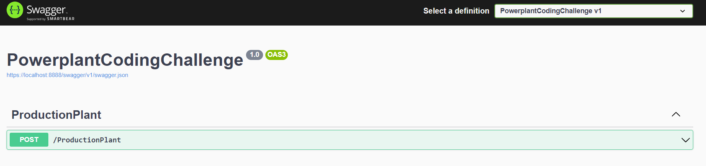
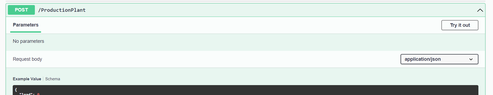
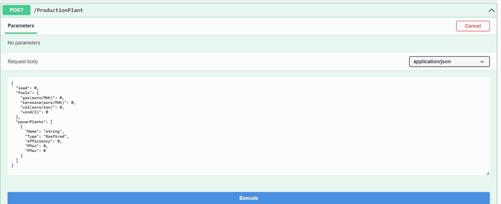

# powerplant-coding-challenge

## Welcome !

## The challenge
This repo contains a .net 6 solution to solve the powerplant-coding-challeng.

## How to Run and Install the application

Using Visual Studio 2022, run the application and immediately the browser is going to open a swagger documentation.

	https://localhost:8888/swagger/index.html

To test the api click on Post and Try it out.

Once a request body is editable, substitute the body following the schema and click on Execute.
