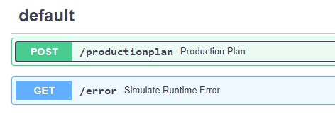

# powerplant-coding-challenge


## Welcome !

This repo is created to show the solution for **powerplant coding challenge** provided by [Engie - GEM](https://gems.engie.com/). You can access  [the original Readme](original_README.md) and [repo](https://github.com/gem-spaas/powerplant-coding-challenge) of the challenge with [link]

## Understand the Problem
Main problem is that **we can not store the electricity in a cheap way**. Because of that we need to predict the **demand** about electricity consumption. To meet this electricity demand, there are different types of power plants, like ones using **gas, kerosine, or even windmills**. Each power plant has its own **cost** to produce electricity and the cost generally is like below for all of them.
- Windmills (0) < gas (\$) < kerosine (\$$)

<br>There are 3 types of **powerplant** for 3 types of energy

1. Gasfired (gas)
2. Turbojet (kerosine)
3. Windturbine (wind)

<p>
An energy production company may utilize various types of power plants to fulfill electricity demand. In addition, gasfired powerplants might incur different efficiency, but gas price is same.
</p>

<p>
So, at any given moment, we need to decide which power plants to turn on to meet the electricity demand in the most cost-effective way. This is where the "unit-commitment problem" comes in. We have to figure out the best combination of power plants to use, considering their costs and how much electricity they can produce.
</p>

<p>
Here's another thing to consider: Some power plants have a minimum amount of electricity they have to produce when they're turned on. We call this the "Pmin." So, when deciding which power plants to activate, we need to think about both their maximum capacity (Pmax) and this minimum amount they have to generate (Pmin).
</p>

<p>
The goal is to supply the needed electricity at the lowest cost by choosing the right combination of power plants, considering their different costs, capacities, and minimum production requirements.
</p>

## Solution
<p>The primary challenge lies in establishing the merit order, a crucial factor in determining the activation sequence of power plants and the corresponding power output. This sequence is determined based on the cost of fuels associated with each power plant, forming the foundation for decisions on which power plants to activate and the quantity of power they will generate.<p>

<p>Certainly! We aim to determine the minimum cost of meeting electricity demand by considering the constraints of various power plants. The selection process relies on the cost of energy production from these power plants. This involves employing a **uniform cost search algorithm**. Unlike having a predefined map, path, or graph illustrating the sequence of power plants in operation, we will generate multiple path options by initiating each power plant. Subsequently, we will choose the path with the lowest cost for our electricity production.</p>


# Installation

## 0) Environment Management with Conda
pre-commit is optional, not obligation
```
conda create --name gem python=3.11
conda activate gem
pip install --upgrade pip
pip install -r requirements.txt
pre-commit install
```

## 1) TESTS
- Check the test code in [tests folder](tests/).
### Unit Tests
- The purpose of unit testing is to validate that each unit of the software performs as designed.
```
pytest tests/unit_tests
```
### Integration Tests
- The goal of integration testing is to detect issues that may arise when API is running.
```
pytest tests/integration_tests
```
### Performance Tets
- The primary goal of performance testing is to identify and eliminate performance bottlenecks, ensuring that the application meets the desired performance criteria and provides a satisfactory user experience.
```
pytest tests/performance_tests/test_example_payloads.py
```

## 2) API
- Run API
```
uvicorn app.main:app --port 8888 --reload
```
- See the running API on ['http://localhost:8888/docs'](http://localhost:8888/docs) and Find the API documentation showing the endpoints
- Send post and get requests to check whether API is working correctly. You can use example [payloads](example_payloads) to send an example post request.
- Simulate error by sending get request in "/error" endpoint, and find the logs in error.log file in main folder.
- The whole code about API is inside [app](app/) folder.


## 3) [Install pre-commit](https://pre-commit.com/) *(optional, not obligation)*
- Use black code formatter and check code style with flake8.
- When you want to commit anything in git, pre-commit will check automatically your code.
- You can check your whole code the command below.
```
pre-commit run --all-files
```

## 4) [Version-bump your software with a single command!](https://pypi.org/project/bumpversion/)
- Update the software version based on the scale of changes. We will use VERSION on the **docker tag** which we build.
```
bumpversion patch --allow-dirty
bumpversion minor --allow-dirty
bumpversion major --allow-dirty
```

## 5) Build  and Run Docker Container
- Use app/requirements.txt in [Dockerfile](Dockerfile) to install the environement with only neccessary libraries to decrease the resource capacity of a Docker container.
```
docker build -t productionplan_api:$(cat VERSION | tr -d '\r') .
docker run -d -p 8888:8888 productionplan_api:$(cat VERSION | tr -d '\r')
```
